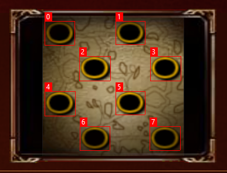

# The-BFME-API
This Library allows you to launch and interact with BFME games as well as create virual LAN network rooms to play together even when you and other players are not on the same network.

## Install
The best way is probably to add it via NuGet: https://www.nuget.org/packages/The_BFME_API

## Supported games
- BFME1
- BFME2 (WIP)
- RotWK (WIP)

## Features
- Create virtual LAN networks so you and your opponents can play while on completely different networks
- Launch BFME as host or offhost and automaticaly:
  - Automaticaly Create ingame room if host or join available ingame room if offhost
  - Set player username
  - Set player color
  - Select player army
  - Select player team
  - Select player hero (BFME2 and RotWK)
  - Set game rules (BFME2 and RotWK)
  - Select spot on map
  - Select map
  - Start the match
  - Detect who won the match (this is work in progress)

## Spot detection
With some pretty clever code, this library is able to automaticaly detect spots from any map, and assign an index to them.



There is also a ```MapSpotTool``` tool that allows you to render this image from any map image provided. This is extremely useful for mapmakers who want to make sure they put players on the same team in the correct spots.

## Examples
There is a ```NetworkExample``` and a ```GameExample``` for each supported game in this repository, those can provide a good understanding on how to use the library, but here are some basic examples...
#### Game client (BFME1)
```csharp
// Create a game client and assign the player parameters to it
Bfme1Client gameClient = new Bfme1Client
{
    Username = "Hello world",
    PlayerColor = PlayerColor.Purple,
    MapId = "maps_5Cmap_20mp_20dagorlad_5Cmap_20mp_20dagorlad_2Emap",
    Army = PlayerArmy.Mordor,
    Team = PlayerTeam.Team4,
    SpotIndex = 0
};

// Launch as host
await gameClient.LaunchAsHost();

// Launch as offhost
await gameClient.LaunchAsOffhost();

// If you are the host, start the game
gameClient.StartGame();

// And finaly close the game
await gameClient.CloseGame();
```

#### Game client (BFME2 and RotWK)
```csharp
// Create a game client and assign the player parameters to it
Bfme2Client gameClient = new Bfme2Client
{
    Username = "Hello world",
    PlayerColor = PlayerColor.Green,
    MapId = "maps_5Cmap_20wor_20mordor_5Cmap_20wor_20mordor_2Emap",
    Army = PlayerArmy.Elves,
    Hero = PlayerHero.None,
    Team = PlayerTeam.Team2,
    SpotIndex = 0
};

// Launch as host
await gameClient.LaunchAsHost();

// Optionaly, you can also provide gamerules
await gameClient.LaunchAsHost(initialResources: 1000, commandPointFactor: 100, allowCustomHeroes: false, allowRingHeroes: false);

// Launch as offhost
await gameClient.LaunchAsOffhost();

// If you are the host, start the game
gameClient.StartGame();

// And finaly close the game
await gameClient.CloseGame();
```

#### Networking
```csharp
// Open a new virtual LAN network (virtual LAN network = room)
string newRoomId = await NetworkManagement.OpenRoom();

// Create a networking client
NetworkClient client = new NetworkClient();
await client.Init();

// Join a room (in this case the one we just created)
await client.JoinRoom(newRoomId);

// Leave your room
await client.LeaveRoom();

// Close a room (in this case the one we just created)
await NetworkManagement.CloseRoom(newRoomId);

// And finaly dispose the client when we are done using it
client.Dispose();
```

## Additional info
- You can get a map's Id by doing the following:
  - Open the game
  - Go to Multiplayer>Network>Create game
  - Select the desired map
  - Click cancel
  - Open ```%appdata%/My Battle for Middle-earth Files/Network.ini``` and the Id of the map is the value for ```Map```
  - (This only works in BFME1, getting the map Ids in BFME2 is a little bit more complicated... I'll post a list of all default maps sometime in the future...)
